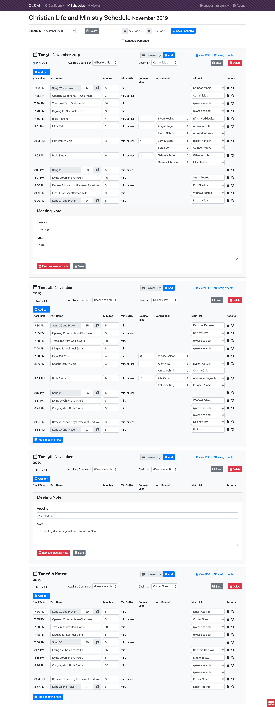

# Christian Life & Ministry Creator

## About
An web based application that can be used to manually assign parts on the CL&M Meeting

## CL&M Creator Uses
* [CakePHP](http://cakephp.org) 3.x.
* Bootstrap 4.x
* [cakephp3-bootstrap-helpers](https://github.com/Holt59/cakephp3-bootstrap-helpers/tree/4.0.1-alpha)
* MySQL
* TCPDF


## Installation

1. Clone this repo
```
git clone https://github.com/jmcd73/clam.git clam
```
3. create a database for the app in mysql/mariadb
```
# in mysql client
CREATE DATABASE clamdb;
GRANT ALL PRIVILEGES ON clamdb.* TO clamdbuser@localhost IDENTIFIED BY 'AReallyLongAndComplexPassWord';
```

4.  load the db/sample/clam.sql into it
```
mysql -uroot -p clamdb < db/sample/clam.sql
```
4. Copy config/app.default.php to config/app.php and modify the `Datasources => default` section to point to the database
```php
 'Datasources' => [
        'default' => [
            'className' => 'Cake\Database\Connection',
            'driver' => 'Cake\Database\Driver\Mysql',
            'persistent' => false,
            'host' => 'localhost',
            /**
             * CakePHP will use the default DB port based on the driver selected
             * MySQL on MAMP uses port 8889, MAMP users will want to uncomment
             * the following line and set the port accordingly
             */
            //'port' => 'non_standard_port_number',
            'username' => 'clamdbuser',
            'password' => 'AReallyLongAndComplexPassWord',
            'database' => 'clamdb',
            'encoding' => 'utf8',
            'timezone' => 'UTC',
            'flags' => [],
            'cacheMetadata' => true,
            'log' => false,

            /**
             * Set identifier quoting to true if you are using reserved words or
             * special characters in your table or column names. Enabling this
             * setting will result in queries built using the Query Builder having
             * identifiers quoted when creating SQL. It should be noted that this
             * decreases performance because each query needs to be traversed and
             * manipulated before being executed.
             */
            'quoteIdentifiers' => false,

            /**
             * During development, if using MySQL < 5.6, uncommenting the
             * following line could boost the speed at which schema metadata is
             * fetched from the database. It can also be set directly with the
             * mysql configuration directive 'innodb_stats_on_metadata = 0'
             * which is the recommended value in production environments
             */
            //'init' => ['SET GLOBAL innodb_stats_on_metadata = 0'],

            'url' => env('DATABASE_URL', null),
        ],

```

7. You can use Apache/IIS/Nginx to serve the webroot folder or use `bin/cake server` to use the embedded PHP server
```
bin/cake server
```
8. Connect to the app http://localhost:8765 and login
* Username - `admin`
* Password - `admin`

6. Use the `Configure` dropdown menu to add or edit:
*  People,
*  Privileges
*  Parts

7. Use the `Schedules` menu to create, edit and update meeting schedules

## Sample of PDF Schedule Output

[CLAM Example](docs/sample/2019-11_Nov_CLM.pdf)

## Screen shot of schedule edit screen

This is a React Single Page Application. The React code is located in the clam-react folder




